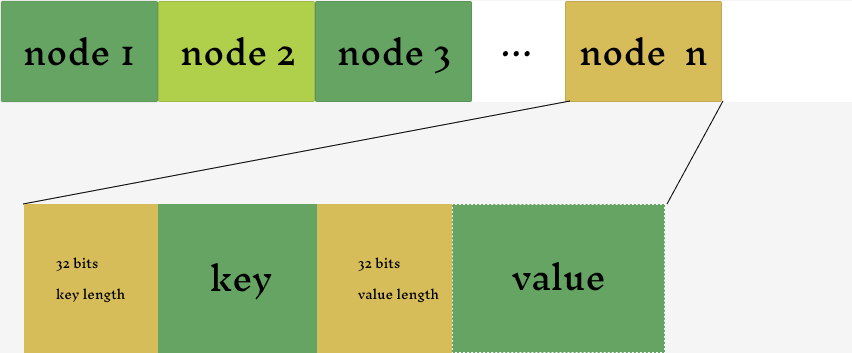

[](https://github.com/sharkdp/fd/actions/workflows/CICD.yml)
okutils
===== 
a python utils

# Document

## mp_append_log

append log to file, multiple process supported

```python
from okutils.tools import mp_append_log

mp_append_log("debug.log", "welcome")
```

## Simple Document Manager

```text
simple document manager include readers and writers of a file in format of key-value append only file(we call it bin-file).
A bin-file is a file of a series of nodes, and every node has a key and value. The value is always compressed.
```



[binfiles](https://github.com/skiloop/binfiles) is a command line tool for bin-file 